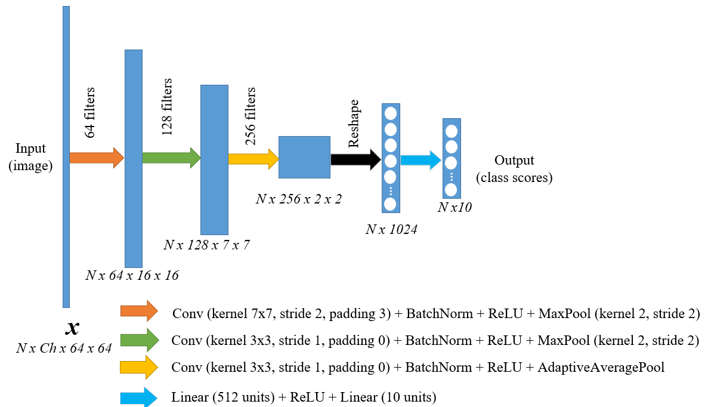

# PyTorch-TrainingExample
This is a training example using PyTorch framework.
A basic CNN is trained to classify handwritten digits from MNIST [1] dataset

## CNN model
An arbitrary CNN based model, inspired by Alex-NET [2] is defined for this example. It has the following architecture:

## Implementation
To train the model you have to run the main.py file. The implemented training process is:
 1) Create an instance of a Neural Network
 2) Create an instance of a MNIST dataset (train and val) and corresponding dataloaders
 3) Create an instance of an Adam Optimizer and loss criterion
 4) Loop over each epoch
     1) Loop over each minibatch
         1) Move data to DEVICE
         2) Clear model gradients
         3) Forward pass
         4) Calculate loss and save value
         5) Backward pass (backpropagation of gradients)
         6) Update model parameters (weights)
     2) Loop to evaluate model
         1) Forward pass the validation data
         2) Calculate validation error and register it
         3) Save model weights if the accuracy is higher than before
 5) Save loss values and error values

## References
[1] Y. LeCun, L. Bottou, Y. Bengio, and P. Haffner, “Gradient-based learning applied to document recognition,” Proceedings of the IEEE, vol. 86, no. 11, pp. 2278–2323, 1998, doi: 10.1109/5.726791.

[2] A. Krizhevsky, I. Sutskever, and G. E. Hinton, “ImageNet Classification with Deep Convolutional Neural Networks,” in Advances in Neural Information Processing Systems, 2012, vol. 25. [Online]. Available: https://proceedings.neurips.cc/paper/2012/file/c399862d3b9d6b76c8436e924a68c45b-Paper.pdf

